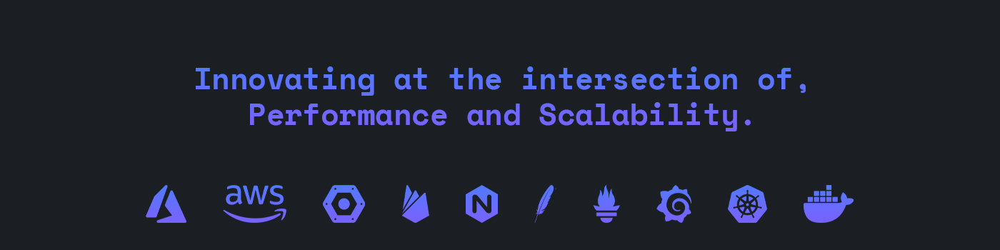

[](https://saadahmedev.com)

I am a passionate Software Engineer with expertise in Distributed Systems, Cloud-Native Architecture, and Microservices, focusing on performance and scalability. With over five years of hands-on experience, I transitioned from a successful three-year career in Native Android Development to working with distributed systems and cloud technologies.

Currently, I design and implement large-scale distributed systems, leveraging microservices architecture to build scalable and resilient solutions. I actively solve complex, high-impact challenges, ensuring systems perform efficiently under heavy loads and scale effortlessly in cloud environments.

I am driven by the challenge of optimizing systems for performance and reliability while collaborating with teams to deliver cutting-edge solutions. Let’s connect to explore opportunities around distributed systems, microservices, or other technology-related challenges to which I can contribute.

### OPEN SOURCE LIBRARIES

| 🎁 Projects                                                                                         |                                                                ⭐ Stars                                                                |                                                               📚 Forks                                                                |                                                               🛎 Issues                                                                |                                                             📬 Pull requests                                                              |
|-----------------------------------------------------------------------------------------------------|:-------------------------------------------------------------------------------------------------------------------------------------:|:-------------------------------------------------------------------------------------------------------------------------------------:|:--------------------------------------------------------------------------------------------------------------------------------------:|:-----------------------------------------------------------------------------------------------------------------------------------------:|
 | <a href="https://github.com/saadahmedscse/Android-Popup-Dialog"><b>Android Popup Dialog</b></a>     |    |    |    |    |
 | <a href="https://github.com/saadahmedscse/Helper-Widgets-Android"><b>Helper Widgets Android</b></a> |  |  |  |  |
 | <a href="https://github.com/saadahmedscse/BD-SMS-Gateway"><b>BD SMS Gateway</b></a>                 |          |          |          |          |
 | <a href="https://github.com/saadahmedscse/ShortIntent"><b>Short Intent - Intent Library</b></a>     |             |             |             |             |
 | <a href="https://github.com/saadahmedscse/TinyDB"><b>Tiny DB - Simple Shared Preference</b></a>     |                  |                  |                  |                  |

### SKILLS
```json
{
  "Languages"             : ["Java", "Kotlin", "JavaScript", "TypeScript"],
  "Developments"          : ["Spring Boot", "Android"],
  "Distributed Systems"   : ["Docker, Kubernetes, Microservices, Kafka, CI-CD"],
  "Cloud Platforms"       : ["AWS, Firebase, Supabase"],
  "DBMS"                  : ["MySQL", "PostgreSQL"]
}
```

### SOCIAL LINKS
```json
{
  "LeetCode"        : "https://leetcode.com/saadahmedscse/",
  "LinkedIn"        : "https://www.linkedin.com/in/saadahmedscse/",
  "Stack Overflow"  : "https://stackoverflow.com/users/10610218/saad-ahmed",
  "Facebook"        : "https://www.facebook.com/SaadAhmedSCSE/",
  "Discord"         : "https://discord.gg/263rX7JwfZ"
}
```

<h3 align="center">Do follow me on:</h3>
<p align="center">
<a href="https://linkedin.com/in/saad-ahmed-scse" target="blank"></a>
<a href="https://fb.com/saadahmedscse" target="blank"></a>
<a href="https://instagram.com/vamp9re" target="blank"></a>
<a href="https://leetcode.com/saadahmedscse/" target="blank"></a>
<a href="https://stackoverflow.com/users/10610218/saad-ahmed" target="blank"></a>
<a href="https://discord.gg/263rX7JwfZ" target="blank"></a>
</p>

<a href="https://github.com/saadahmedscse/"></a>
</br>
</br>
<a href="https://leetcode.com/saadahmedscse/"><a href="https://github.com/saadahmedscse/">
