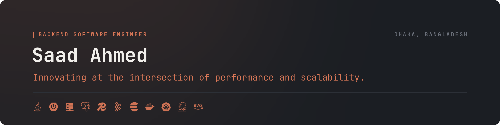
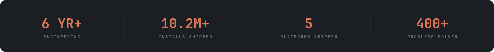
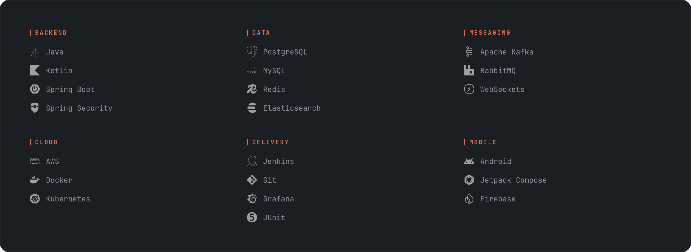
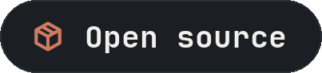
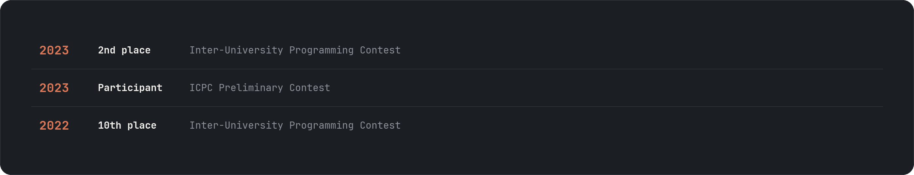

 

> Backend engineer in Dhaka, six years across banking, fintech and health platforms — the last three on backend and infrastructure. Mostly Spring Boot on Kubernetes, and the integration work that keeps new products talking to the systems underneath them.

<h3></h3>

<h3></h3>

<table width="100%">
<tr>
<td width="50%" valign="top">
<b>Toffee</b> 
BANGLALINK &middot; VIDEO STREAMING
  
Lifted streaming quality and app performance by roughly 30% through refactoring, and wired in four analytics streams across acquisition, attribution, engagement and retention.
  
<code>~30% faster</code>
</td>
<td width="50%" valign="top">
<b>MyBL</b> 
BANGLALINK &middot; SELF-CARE TELECOM
  
Optimised list rendering with RecyclerView across the app's screens, lifting scroll performance, and standardised accessibility identifiers so QA could automate against them.
  
<code>10M+ downloads</code>
</td>
</tr>
<tr>
<td width="50%" valign="top">
<b>Pocket eWallet</b> 
BASHUNDHARA GROUP &middot; DIGITAL WALLET
  
Spring Boot microservices on Kubernetes. Bank transfer, card transfer and beneficiary management, plus eKYC with liveness detection.
  
<code>50,000+ downloads</code>
</td>
<td width="50%" valign="top">
<b>AB Direct</b> 
AB BANK &middot; RETAIL BANKING
  
Brought Bangladesh Bank's IDTP interoperable payment rail into the platform, adding interbank transfer to retail banking.
  
<code>100,000+ downloads</code>
</td>
</tr>
<tr>
<td width="50%" valign="top">
<b>Unet</b> 
UNITED COMMERCIAL BANK &middot; RETAIL BANKING
  
Designed trust-cum-settlement handling across backend and client, and carried it through user testing.
  
<code>100,000+ downloads</code>
</td>
<td width="50%" valign="top">
<b>Reaction Engine SDK</b> 
BANGLALINK &middot; IN-APP ENGAGEMENT
  
Three configurable interaction types delivered over WebSockets and REST, taking a self-care app from no in-app reactions to a configurable engagement layer.
  
<code>3 interaction types</code>
</td>
</tr>
</table>

<h3></h3>

<table width="100%">
<tr>
<th width="26%" align="left">Library</th>
<th width="58%" align="left">What it does</th>
<th width="16%" align="left">Stars</th>
</tr>
<tr>
<td valign="top"><b><a href="https://github.com/DBSloop/sloop">Sloop</a></b></td>
<td valign="top">Database toolkit: everyday operations, mirroring, backups, traffic monitoring, and multi-database sync on a cron or in realtime. Native on Windows, Linux and macOS.</td>
<td valign="top"></td>
</tr>
<tr>
<td valign="top"><b><a href="https://github.com/saadahmedscse/Android-Popup-Dialog">Android Popup Dialog</a></b></td>
<td valign="top">Popup dialogs with and without animation.</td>
<td valign="top"></td>
</tr>
</table>

<h3></h3>

---

<h3></h3>

  <a href="https://saadahmedev.com">saadahmedev.com</a>
  &nbsp;&nbsp;·&nbsp;&nbsp;
  <a href="mailto:saadahmedsoft@gmail.com">saadahmedsoft@gmail.com</a>
  &nbsp;&nbsp;·&nbsp;&nbsp;
  <a href="https://www.linkedin.com/in/saadahmedscsev2/">LinkedIn</a>
  &nbsp;&nbsp;·&nbsp;&nbsp;
  <a href="https://leetcode.com/u/saadahmedscse/">LeetCode</a>
  &nbsp;&nbsp;·&nbsp;&nbsp;
  <a href="https://stackoverflow.com/users/10610218/saad-ahmed">Stack Overflow</a>

